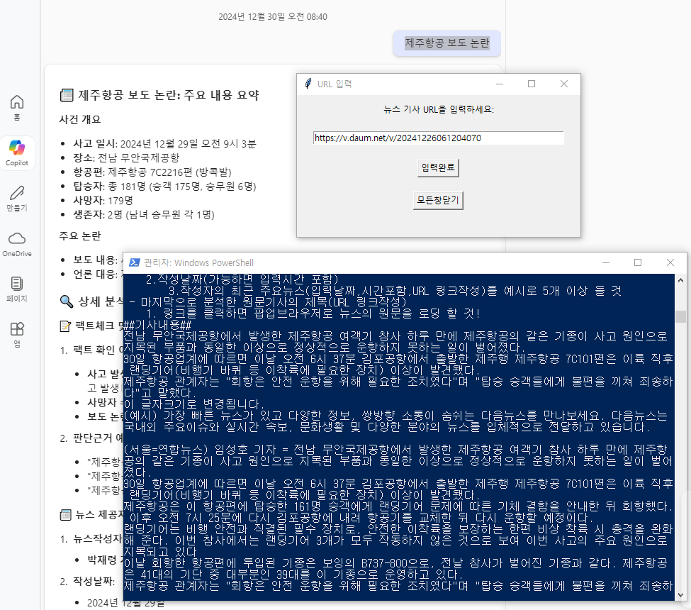

# 📰 News Scraper

이 프로젝트는 뉴스 기사의 텍스트를 자동으로 추출하고 클립보드에 복사하는 도구입니다.

## 📋 주요 기능

- 뉴스 기사 URL 입력
- 자동으로 텍스트 추출
- 클립보드에 결과 복사
- Tkinter 기반 GUI 인터페이스


## 📁 프로젝트 구조

```bash
news_scrapper/
├── main.py             # 🏡 메인 애플리케이션
├── src/
│   ├── scraper/
│   │   └── news_scraper.py  # 🕸️ 웹 스크래핑 로직
│   └── gui/
│       └── news_gui.py      # 🖥️ Tkinter GUI 코드
├── config/
│   ├── settings.py    # 🔧 앱 설정
│   └── prompts.json   # 📝 프롬프트 설정
└── tests/
    ├── test_scraper.py  # 🧪 스크래핑 테스트
    └── test_gui.py      # 🧪 GUI 테스트
```

## 📦 의존성

- pyperclip: 클립보드 기능
- beautifulsoup4: HTML 파싱
- requests: HTTP 요청


## 🛠️ 설치 및 실행

### 1. 의존성 패키지 설치

```bash
pip install -r requirements.txt
```

### 2. 실행 방법

#### 직접 실행

```bash
python main.py
```

#### 바탕화면 바로가기 생성

1. 프로젝트 폴더에 있는 `main.py`를 마우스 오른쪽 클릭
2. '바탕화면으로 보내기' > '바로가기 만들기' 선택
3. 생성된 바로가기 아이콘을 원하는 위치로 이동


## 📸 결과물 예시

### 1. GUI 인터페이스



### 2. 클립보드 결과 예시

```
##URL_ARTICLE : https://example.com/article
[기사 제목]
[기사 내용]
```
